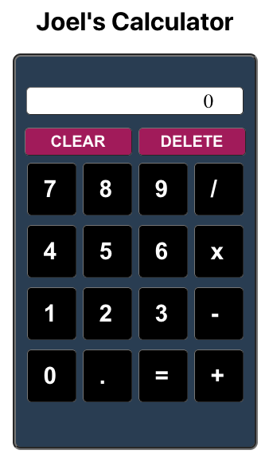

## React Calculator
I was recently asked to create a calculator web application as part of a hiring process. What this web app does that many don't is it avoids many bugs of allowing multiple decimal points or operator symbols. I also wanted to make the calculator look realistic.

The reason I put significant effort into this calculator app is because I wasn't satisfied with the one I created for my bootcamp. It was early in the program, and it used jQuery with HTML; it didn't look good, and it didn't operate well nor very intuitively.

My goal for this new calculator (using React, Node, and PostgreSQL) was not only to advance in the hiring process for that particular job, but also to demonstrate improvement to myself and build something I'd be proud of.

Visit the app online at [Heroku](https://rocky-harbor-04010.herokuapp.com/)

## Screenshot

